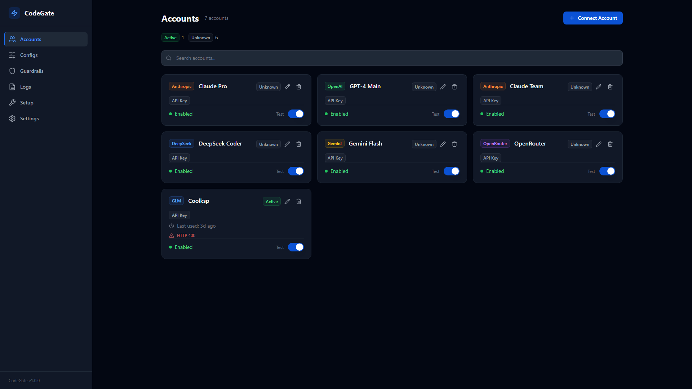
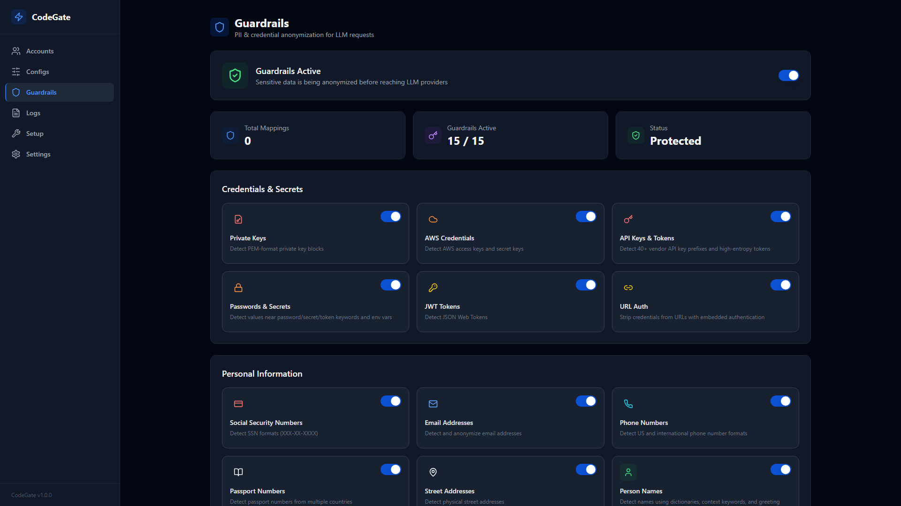
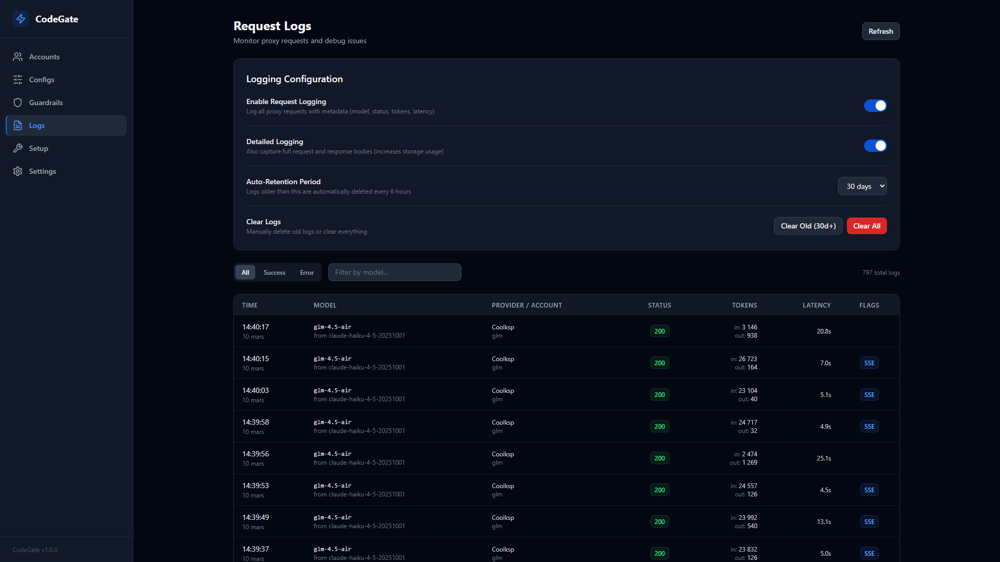
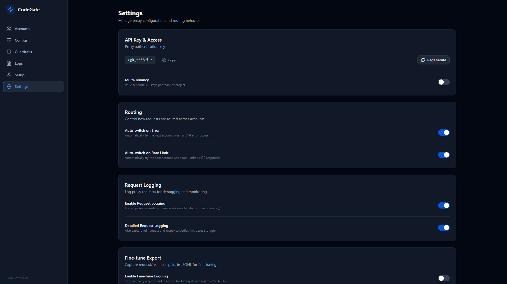
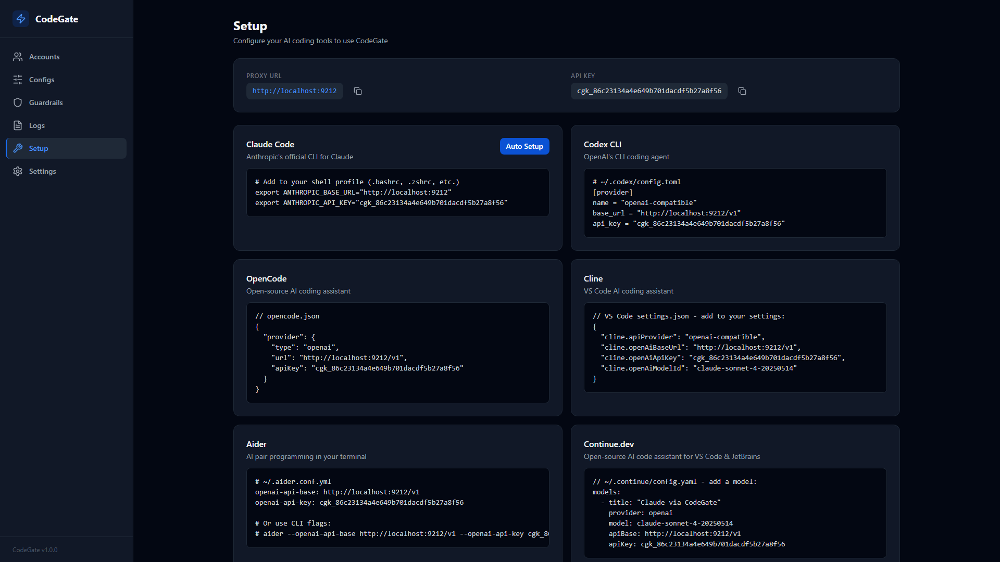

# CodeGate

**One proxy. Every LLM provider. Every coding agent.**

I have multiple Claude subscriptions (work, personal, different tiers) and even their max usage was not enough. I wanted a single endpoint that could spread requests across all of them, automatically fail over when one gets rate-limited, and let me mix in other providers without reconfiguring every tool.

**One proxy URL. Every provider. Zero config changes per tool.**



## Features

### Multi-Provider Routing

Connect **11+ providers** through a single endpoint with 4 routing strategies:

| Provider | Auth | Notes |
|----------|------|-------|
| Anthropic | API Key / OAuth | Native Messages API |
| OpenAI | API Key / OAuth | Chat Completions API |
| OpenAI (Subscription) | OAuth | Codex subscription tokens |
| OpenRouter | API Key | Access 100+ models |
| Google Gemini | API Key | Gemini models |
| DeepSeek | API Key | DeepSeek-V3, R1, Coder |
| GLM (Zhipu) | API Key | GLM-4 family |
| Cerebras | API Key | Fast inference |
| Minimax | API Key | MiniMax models |
| Codex | API Key | OpenAI Codex |
| Custom | API Key | Any OpenAI-compatible endpoint |

**Routing strategies:** Priority, Round Robin, Least Used, Budget Aware. Create named configs with tier-based routing (opus / sonnet / haiku), each mapping to specific accounts with optional model remapping.

### Automatic Failover

When a provider returns an error or hits a rate limit, CodeGate automatically tries the next account:

- Cooldown with exponential backoff (15s to 300s)
- Retry-After header parsing
- Auto-switch on error for seamless fallback
- Auto-switch on rate limit to rotate across accounts

### Bidirectional Format Conversion

CodeGate accepts both **Anthropic Messages API** and **OpenAI Chat Completions API** on the same port. It detects the inbound format from the request path and converts to whatever the target provider needs:

- Anthropic tool calls and OpenAI function calls
- System prompts, thinking blocks, multi-turn conversations
- Token usage mapping across formats
- DeepSeek reasoning content
- Image content (base64 and URL)
- Full streaming SSE support with on-the-fly conversion

### Privacy Guardrails

**15 built-in detectors** anonymize sensitive data before it reaches the LLM provider:



| Category | Detectors |
|----------|-----------|
| PII | Email, phone, SSN, names, addresses, passports |
| Financial | Credit cards (Visa/MC/Amex/Discover), IBAN |
| Credentials | API keys (40+ vendor prefixes), AWS keys, JWT, private keys (RSA/DSA/EC/PGP), URL-embedded credentials, passwords |
| Network | IP addresses |

All replacements use **AES-256-CTR deterministic encryption** so the same input always produces the same token. Conversations stay coherent across turns. Responses are automatically deanonymized before reaching your agent.

### Request Logging & Fine-Tune Dataset Generation

| | |
|---|---|
|  |  |

- Full request logging with model, provider, status, tokens, latency
- Capture request/response pairs as **JSONL datasets** for training custom models
- **Last-turn-only mode** — avoids duplicating 200k-token context windows
- Conversation tracking with turn indices + gzip compression

### One-Click Setup for Every Tool



Ready-made snippets for Claude Code, Codex CLI, OpenCode, Cline, Aider, Continue.dev, and any OpenAI/Anthropic-compatible client. Auto-Setup for Claude Code configures everything in one click.

### Multi-Tenancy

Share one CodeGate instance across multiple users or teams:

- Per-tenant API keys with `cgk_` prefix
- Isolated rate limits (requests/minute per tenant)
- Per-tenant routing configs
- Settings inheritance — tenant settings override globals with fallback

---

## Quick Start

### Docker (recommended)

```bash
git clone https://github.com/NodeNestor/CodeGate.git
cd CodeGate
docker compose up -d --build
```

**Dashboard:** http://localhost:9211 | **Proxy:** http://localhost:9212

### From Source

```bash
git clone https://github.com/NodeNestor/CodeGate.git
cd CodeGate
npm install && npm run build && npm start
```

---

## Connect Your Tools

Point your tools at the proxy. Both Anthropic and OpenAI formats work on the same port, auto-detected from the request path.

### Claude Code

```bash
claude config set --global apiUrl http://localhost:9212
```

### Cursor / Windsurf / Continue

Set the API base URL in your editor's AI settings:

```
http://localhost:9212/v1
```

### Any OpenAI-compatible client

```bash
export OPENAI_BASE_URL=http://localhost:9212/v1
export OPENAI_API_KEY=your-codegate-key
```

### Any Anthropic client

```bash
export ANTHROPIC_BASE_URL=http://localhost:9212
export ANTHROPIC_API_KEY=your-codegate-key
```

---

## Architecture

Two processes sharing one SQLite database. No external services required.

```
Port 9211 — Dashboard (Node.js)             Port 9212 — LLM Proxy (Go)
├── React SPA                                ├── Format detection (Anthropic / OpenAI)
├── REST API (accounts, configs,             ├── Tenant authentication
│   tenants, settings, guardrails,           ├── Rate limiting (tenant + account)
│   logs, sessions, setup)                   ├── Guardrail anonymization
└── Setup wizard                             ├── Config-based routing + failover
                                             ├── Format conversion
              ┌──────────────┐               ├── SSE stream proxying
              │ SQLite (WAL) │               ├── Response deanonymization
              │ codegate.db  │               ├── Fine-tune dataset capture
              └──────────────┘               └── Usage logging
```

### Encryption at Rest

- **AES-256-GCM** for API keys and OAuth tokens
- **AES-256-CTR** (deterministic) for guardrail anonymization

Keys auto-generate on first run. Byte-compatible between Node.js dashboard and Go proxy.

---

## Environment Variables

| Variable | Default | Description |
|----------|---------|-------------|
| `UI_PORT` | `9211` | Dashboard and API port |
| `PROXY_PORT` | `9212` | LLM proxy port |
| `DATA_DIR` | `./data` | SQLite database and encryption keys |
| `PROXY_API_KEY` | — | Global auth key for the proxy |
| `ACCOUNT_KEY` | — | Encryption key override for credentials |
| `GUARDRAIL_KEY` | — | Encryption key override for guardrails |

---

## Development

```bash
npm install
npm run dev          # Hot reload for server + client
npm run build        # Production build
npm test             # Node.js tests (Vitest)
cd go && go test ./...  # Go tests
npx tsc --noEmit     # Type check
```

---

## License

[MIT](LICENSE)

---

Built by [NodeNestor](https://github.com/NodeNestor).
